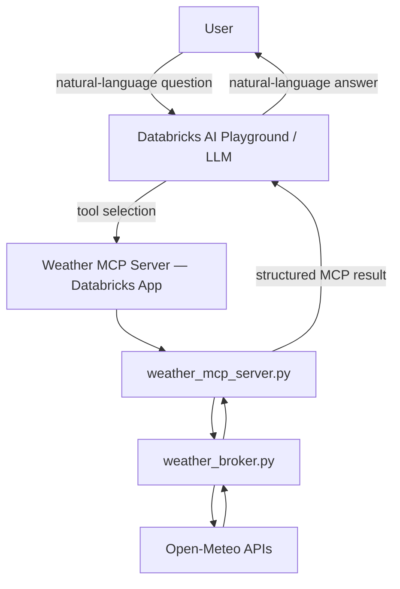
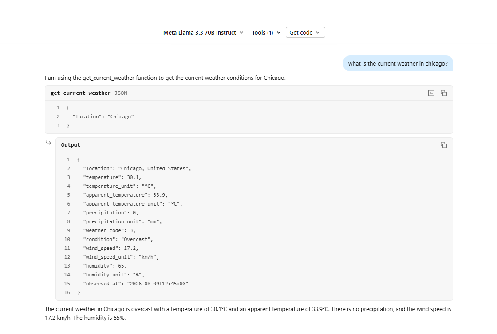
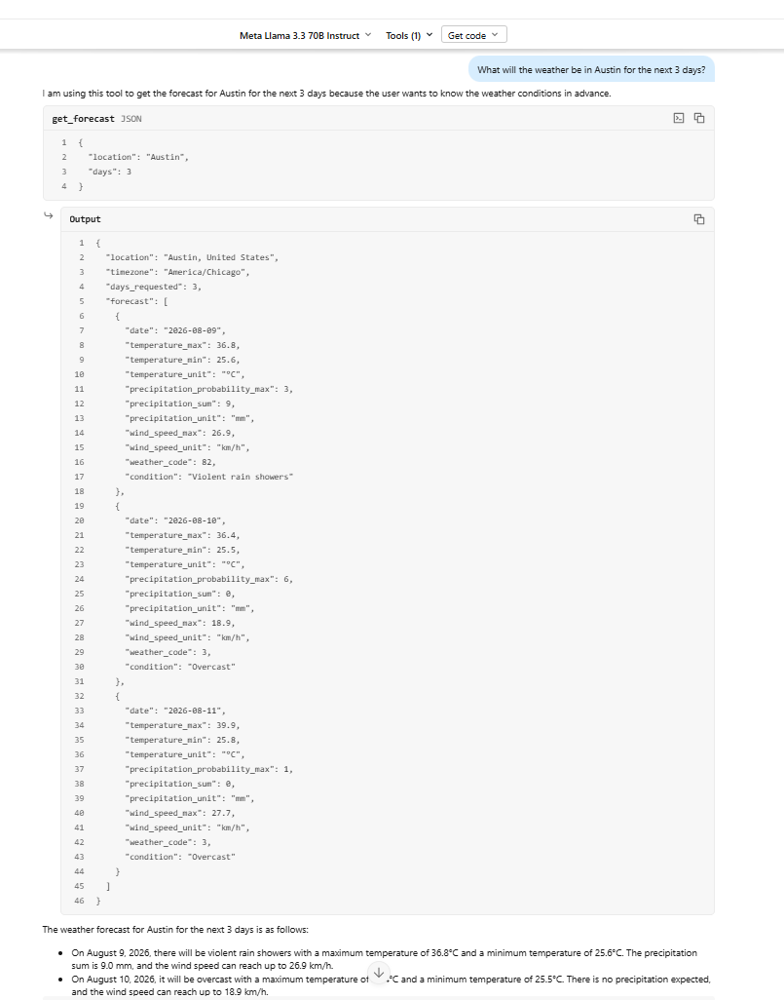

# Weather Prediction MCP Server — Day 3 Assignment

## Project Overview

This project implements a **weather MCP server** using [FastMCP](https://gofastmcp.com). [Open-Meteo](https://open-meteo.com/) provides geocoding, current conditions, and multi-day forecasts — no API key required.

| Component | Role |
|-----------|------|
| `weather_broker.py` | Owns all HTTP/API communication and response parsing |
| `weather_mcp_server.py` | Exposes thin `@mcp.tool` wrappers over the broker |
| Databricks App (`mcp_server/app.yaml`) | Hosts the MCP server in production |
| Databricks AI Playground | LLM uses the deployed MCP server as a tool to answer natural-language weather questions |

The MCP server is deployed as a standalone **Databricks App**. A **Databricks Playground** model is configured with the app as an external MCP tool source and tested end-to-end with natural-language prompts.

## Architecture

The LLM selects which MCP tool to invoke based on the user's question — it does not hard-code tool routing.



## MCP Tools

### Data retrieval

| Tool | Purpose |
|------|---------|
| `get_current_weather(location)` | Current temperature, apparent temperature, precipitation, conditions, wind, humidity, and observation time |
| `get_forecast(location, days=3)` | Daily forecast for 1–7 days: highs/lows, precipitation probability and sum, wind, and conditions |

### Derived capabilities

| Tool | Purpose |
|------|---------|
| `get_travel_recommendation(location, date="")` | Applies deterministic rules (umbrella, jacket, heat, wind warnings) to forecast data — does not echo raw API output |
| `compare_weather(location_a, location_b)` | Compares current conditions and near-term forecast between two cities |

## Design Decisions

- **Open-Meteo** — free, no API key, covers geocoding + current + forecast in one provider; no Databricks secret management needed.
- **Broker isolation** — all HTTP calls and parsing live in `weather_broker.py`; MCP tool functions never call `requests` directly.
- **Thin MCP layer** — `weather_mcp_server.py` delegates to the broker and handles clean error responses.
- **Streamable HTTP** — FastMCP exposes tools over HTTP transport suitable for Databricks App deployment (`DATABRICKS_APP_PORT` / `PORT`).
- **No hallucinated weather** — if geocoding fails or the API is unavailable, tools return clear errors rather than invented values.

## Local Validation

The broker and MCP functions were tested locally before Databricks deployment.

```bash
cd mcp_server
pip install -r requirements.txt
python test_broker.py          # broker smoke tests
python weather_mcp_server.py   # start MCP server (default :8000)
```

Examples exercised locally:

- Current weather for **Chicago** — temperature, conditions, humidity
- **3-day forecast** for Chicago — daily highs, precipitation probability, conditions
- **Travel recommendation** — umbrella/jacket guidance from forecast rules
- **Chicago vs Austin comparison** — side-by-side current and near-term forecast

Invalid city names correctly return a clear location-not-found error.

## Databricks Deployment

The MCP server was deployed successfully as a **Databricks App** from the `mcp_server/` folder and validated through **Databricks AI Playground**.

**Deployment path:** `mcp_server/` (contains `app.yaml`, `weather_mcp_server.py`, `requirements.txt`)

1. Sync or upload the repo to the Databricks workspace.
2. Create and deploy a Databricks App pointing at `mcp_server/`.
3. Attach the deployed app URL as an external MCP tool in AI Playground (or Agent Bricks).
4. Optionally paste `agent/system_prompt.md` as the system prompt to discourage invented weather data.

**End-to-end flow:**

```
Natural-language question
  → LLM chooses MCP tool
  → MCP server invokes broker
  → Open-Meteo response
  → structured MCP result
  → LLM generates final natural-language answer
```

No secrets are required for Open-Meteo. See [Host your own MCP](https://docs.databricks.com/aws/en/agents/mcp-tools/custom-mcp) for Databricks-specific configuration.

## Databricks Playground Validation

The deployed MCP server was attached as a tool to a Databricks Playground model and tested with natural-language questions. The LLM automatically selected the appropriate tool for each prompt.


*Current conditions — model automatically selected `get_current_weather`.*


*Multi-day forecast — model selected `get_forecast` with Austin and `days=3`.*


*Multi-step agent reasoning — user asked about travel to Wisconsin; the model resolved Milwaukee and used weather tools to provide clothing and umbrella guidance.*


*Bonus capability — weather comparison between Chicago and Austin.*

**Example prompts used:**

- "What is the current weather in Chicago?"
- "Will it rain in Austin over the next 3 days?"
- "Should I bring an umbrella in Chicago tomorrow?"
- "Compare the weather in Chicago and Austin"

## Known Limitations / Future Improvements

- **Geocoding ambiguity** — broad inputs (e.g. a state name) may resolve to a representative city rather than the user's exact intent.
- **Simple recommendation rules** — `get_travel_recommendation` uses fixed thresholds; a richer rules engine or LLM post-processing could improve guidance.
- **LLM tool choice** — the model may call `get_forecast` and reason over the result instead of the specialized `get_travel_recommendation` tool.
- **Possible extensions** — severe-weather alerts, historical weather, persistent query/tool tracing, stronger location and date validation.

## Project Layout

```
weather-mcp-agent/
├── mcp_server/
│   ├── weather_mcp_server.py
│   ├── weather_broker.py
│   ├── app.yaml
│   ├── requirements.txt
│   └── test_broker.py
├── agent/
│   └── system_prompt.md
├── docs/screenshots/
├── README.md
└── .gitignore
```

## Open-Meteo Endpoints

| Purpose | URL |
|---------|-----|
| Geocoding | `https://geocoding-api.open-meteo.com/v1/search` |
| Forecast | `https://api.open-meteo.com/v1/forecast` |

## Assignment Completion

| Requirement | Status |
|-------------|--------|
| FastMCP server | ✅ Complete |
| Separate broker/adapter | ✅ Complete |
| Current conditions tool | ✅ Complete |
| Forecast tool | ✅ Complete |
| Prediction/recommendation capability | ✅ Complete |
| Databricks App deployment | ✅ Complete |
| Databricks Playground / LLM integration | ✅ Complete |
| 3+ natural-language demonstrations | ✅ Complete |


## Submission

### Source Code
GitHub repository:
See `docs/url/git link.txt` 

### Databricks Deployment
The Weather MCP Server was deployed as a Databricks App.

The Databricks App URL is intentionally not included in this public
repository because workspace access is restricted.

Deployment evidence is available in:

- `docs/screenshots/00-1-databricks-app-deployment.png`
- `docs/screenshots/00-2-databricks-app-deployment.png`

The screenshots demonstrate successful application deployment and
FastMCP server startup.

> Note: The Databricks App requires access to the corresponding
> Databricks workspace.


### Agent Configuration
The agent system prompt and MCP tool configuration are included under
the `agent/` directory.

### Validation
The deployed MCP server was connected to a Databricks Playground model
and validated using multiple natural-language questions.

See `docs/screenshots/` for:
- Current Chicago weather
- Austin 3-day forecast
- Wisconsin travel recommendation
- Chicago vs. Austin weather comparison